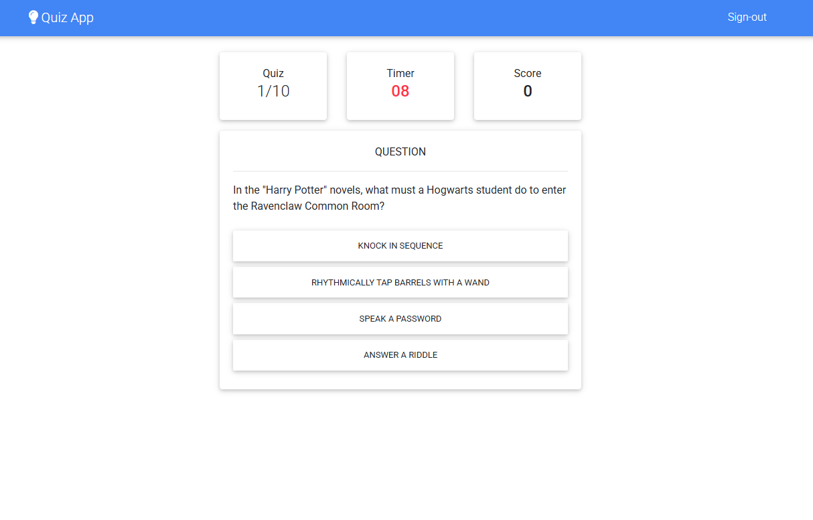

# Quiz App

**Visit Here:** https://michael-quiz-app.vercel.app/

A simple and interactive quiz application built with **React**, **Redux**, and **Firebase Firestore**.  
The app dynamically fetches questions from the [Open Trivia Database (opentdb.com)](https://opentdb.com/) and stores player scores in Firestore.

**Note:** Please don’t mind the UI — it’s kept simple and built using [MDBootstrap (Material Design)](https://mdbootstrap.com/docs/react/).

---



## Features

- Fetches trivia questions from the [OpenTDB API](https://opentdb.com/api_config.php)
- Global state management with **Redux**
- User authentication via **Firebase Authentication (Email & Password)**
- Stores and retrieves quiz scores using **Firebase Firestore**
- Interactive notifications using [SweetAlert2](https://sweetalert2.github.io/) and [IziToast](https://github.com/marcelodolza/iziToast)
- UI built with **React** and **MDBootstrap**
- Real-time updates and smooth transitions

---

## Tech Stack

| Technology                  | Description                                          |
| --------------------------- | ---------------------------------------------------- |
| **React**                   | Front-end framework for building the UI              |
| **Redux**                   | For managing quiz state and user data globally       |
| **Firebase Firestore**      | Cloud NoSQL database for storing quiz results        |
| **Firebase Authentication** | Handles user sign-in with Email and Password         |
| **SweetAlert2**             | Beautiful alert and confirmation modals              |
| **IziToast**                | Lightweight, customizable toast notifications        |
| **MDBootstrap**             | Material Design Bootstrap framework used for styling |
| **OpenTDB API**             | Source of trivia questions                           |
| **Axios / Fetch API**       | For fetching questions from the OpenTDB endpoint     |

---

## Installation & Setup

### 1. Clone the repository

```bash
git clone https://github.com/m-antoni/quiz-app.git
cd quiz-app
```

### 2. Install dependencies

```bash
npm install
```

### 3. Create a Firebase project

- Go to [Firebase Console](https://console.firebase.google.com/)
- Create a new project
- Navigate to **Project Settings → Your apps → SDK setup and configuration**
- Copy your Firebase config object — you’ll use it in your `.env` file

---

## Environment Variables

Create a `.env` file in the **root directory** of your project and add the following:

```bash
# OpenTDB API
REACT_APP_API_ROOT="https://opentdb.com/api.php"

# Firebase Credentials
REACT_APP_API_KEY=""
REACT_APP_AUTH_DOMAIN=""
REACT_APP_DATABASE_URL=""
REACT_APP_PROJECT_ID=""
REACT_APP_STORAGE_BUCKET=""
REACT_APP_MESSAGING_SENDER_ID=""
REACT_APP_APP_ID=""
REACT_APP_MEASUREMENT_ID=""
```

**Note:**  
You can find these Firebase keys by going to:  
**Firebase Console → Project Settings → Your Apps → SDK Setup & Configuration → Config object**

---

### 4. Start the app

```bash
npm start
```

The app will run on [http://localhost:3000](http://localhost:3000).

---

## API Reference

**Open Trivia DB** — [https://opentdb.com/api_config.php](https://opentdb.com/api_config.php)

Example API endpoint used:

```
https://opentdb.com/api.php?amount=10&category=18&type=multiple
```

## Author

**Michael Antoni**  
[GitHub Profile](https://github.com/m-antoni)
